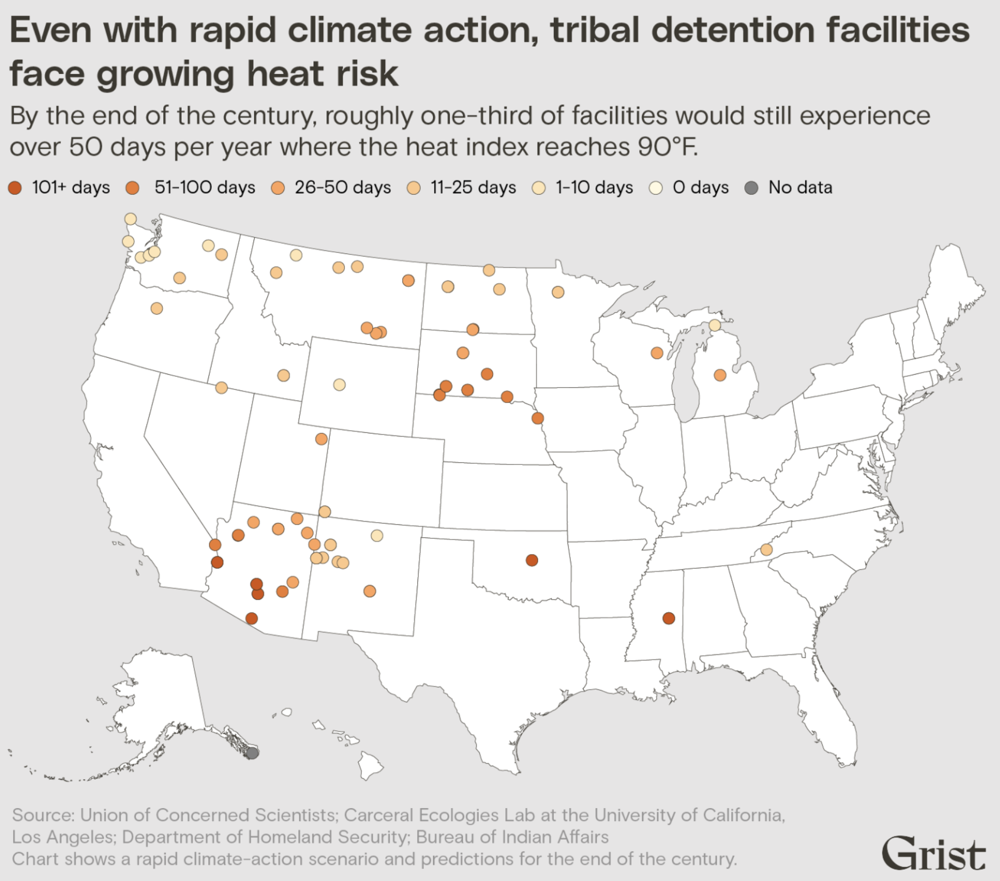

# Tribal jail and detention center locations in the US

Grist is making a dataset on tribal jails in the United States available to journalists and the public after a hard-fought records battle.

Earlier this year, Grist published [an investigation](https://grist.org/indigenous/tribal-jail-climate-change-extreme-heat/) into the disproportionate threat that extreme heat poses to incarcerated populations in detention facilities run by tribal nations or the Bureau of Indian Affairs, or BIA. As part of the project, our reporters sent Freedom of Information Act requests to determine the locations of 81 tribal jail facilities. The Bureau of Indian Affairs, the agency in charge of those records, refused to release the physical addresses of those jails and detention centers. After multiple requests to the BIA, officials revealed only the towns in which tribal facilities were located, but no street or mailing addresses. 

Grist appealed the agency's response — and won. We now have the exact locations of all U.S. tribal jails and detention centers, information that, to our knowledge, has never been made public before.

It should be noted that the release of this information does not change our analysis and only sharpens future researchers’ and newsrooms’ abilities to report on these facilities.

The data are available above in `correction-program-listings.csv`. More information on the records request is available via our [press release](https://grist.org/updates/grist-releases-public-data-on-tribal-jail-and-detention-center-locations-in-the-us/).

